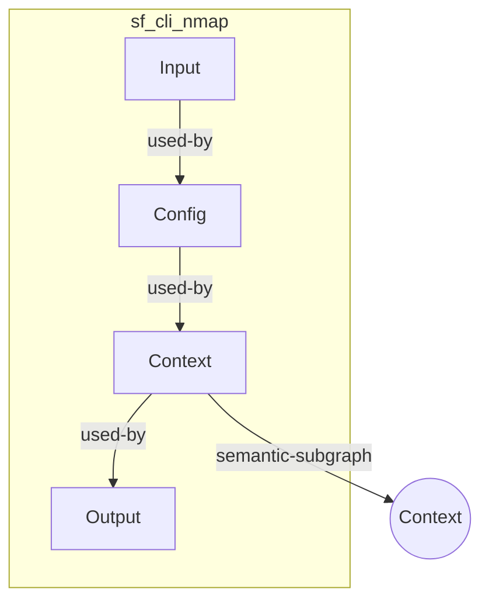

# 02 — Update Widget Requirements

ok, so you have done a really good job with the yaml-workflow-widget, and the yaml tool tips are great. Make sure you abandon any further work on the `yaml-workflow-dag` project, but we have some significant refining to do on the `yaml-workflow-widget` project:

## 1. Small details:

- can we make both the code window and the DAG diagram have a dark/light theme switch and be responsive to an external signal to switch themes
- can we make the code window so it is editable
- can we make the divider between the code and workflow responsive so it can be dragged
- we need to move the capabilities away from using buttons and into behaviour in the main widget, can the dvidier have a subtle arrow on it that cna be clicked to close the code tool, and a corresponding one to re-open
- can we have a subtle settings icon, where one can change the theme on the code window, since it is not so good with green writing 
- can you make the workflow dag pane so the view can be panned and zoomed, but make it easy to get back to this default zoom level
- when you mous over a collapsed nodes input and output circles, you can correctly see the input and output yaml, can you improve it so we can see the rest of the body of the yaml when we mouseover the node, without the input and output, and can edit it


## 2. Rethinking the overall workflow model

The overall workflow must have:

1. a workflow start circle at the top, 
2. below that sometimes there will be a workflow target that is input
3. below that there is always a steps aray that contains scans that:

- sometimes develop data as variables that can be used by subsequent steps to do further scans (i.e. can create a workflow chain), or
- sometimes develop semantic subgraphs that are extracted to be added to the flow of semantic context graphs that culminates in the final context output of the workflow, or
- sometimes do both

4. at the bottom should be a circle, which represents the final context, the sum of all the context flows

So the workflow start is at the top, with edges of sequence ("follows") if they are not overrided by the edges of input-output flow ("uses") in the vertical arrows between aligned nodes (i.e. there can only be a single edge to the input of a node, there can only be one edge label, "uses" has higher priority and overwrites a generic "follows" edge to that port. The context flows go out to the right, or between the centre to interim context collectors, that connect in a vertical flow down to the final larger circle context outcome

### 2.1 Workflow Start Node

At the very top of the diagram, we need a larger circle, which is the start state in terms of the flow model, when you mouse over that initial circle, you find the workflow record, so

```yaml
apiVersion: spiderfeet.workflow/v1
kind: Workflow
id: workflow--1c51e712-b5b5-4ef2-9967-e11debbcc607

info:
  name: Recon Attack Surface
  description: >
    Enumerate domains, map ports/services, and map live web surface + vulns.
    Ports/services chain and web/vuln chain share subfinder_enum, then fan out.
  author: Modeller
  created: "2026-07-07T21:58:32+10:00"
```

### 2.2 Workflow Target Node

Some workflows do not require a target, but most will require a single nugget or list of nuggets as a manual input, as

```yaml
inputs:
  targets:
    type: string_list
    description: Seed domains or URLs (normalized to hostnames for DNS tools)
    default:
      - https://example.com

``` 

if you mouse over the target node, yopu should see the yaml of the inputs data structure

### 2.3 Workflow Edges

We need to acknowledge there are 3 types of flows in our workflow of cli app scanners

1. **Definition Sequence Edge**: Steps defined after another should have a directed edge linked, from output circle of before to input circle of with edge label "follows". It defines the transfer of control without data, for example between the Start Node and the Target Node. It is the default edge to connect nodes with no input, or common input, and invalid if a type 2 edge is assigned. Every node has a minimum of one of these from the output to the next in sequence if no data flow exists
2. **Output to Input Edge**: When the output variable defined in one step is used as the input variable by another step an edge should be drawn between the output circle to the input circle, labelled "used-by"
3. **Export to Context Edge**: Some steps export semantic subgraphs to the context, so that context is made out of combining a sequence of scan subgraphs, which can usually be merged into a single picture through logic and decision rules. Context flows should be labelled "semantic-subgraph"

We currently have input and output circles at the top and bottom edges of each node, which are used by type 1 and 2 edges. The rule is that only one edge can come into an input, and it will be "follows" if there is no "uses" link for that node. The label is on the left and the cross icon to expand the node on the right. We really need another flow for type 3 edges on a different track to the type 1 and 2 flows.

We propose that we swap the position of the expanding cross icon and the label in the collapsed node, so the icon is on the left and the label is on the right. Then a circle must be placed at the middle of the right edge of a collapsed node and its purpose is for flows that export context to a common end point. To the right of this node, horizontally aligned is a circle to collect context data. There are two scenarios:

1. **Single Line Workflow**: When there is a vertical chain of nodes connected by output/input, or by either definition sequence in the YAML file if no other sequence exists, then there will be a vertical line of circles to the right of each node, that collect the context from the previous circle and from the context exported from the node at the left, all using "semantic-subgraph" edges. Finally this context collection for each row of nodes has an edge down to the end large circle which represents the end final context
2. **Dual Line Workflow**: When there is a dual line split, the split lines should be placed further appart, and the context collection circles in between them. The nodes on the right of the split should have their expansion cross icon and label positions swapped back to the original, so label on the left and cross icon on the right. On nodes on the right of a dual line split then the context circle should be on the middle left edge, not the middle right, and the "semantic-subgraph" edge should  point to the left to a common collection circle
3. **Three, four or more lines of Workflow**: When there are more lines, always start with the first two counting from the left, make the third, fifth, seventh and ninth vertical lines exactly like the first. Make the fourth, sixth, eigth and tenth vertical lines exactly like the second, or the one on the right of the dual line setup.

We should trial using a different colour for the 3 different edges, but make sure they are able to be seen by color blind people and are nicely designed, not jarring to the eye, finally you need to create a set of 3 colours like this for both dark and light theme. Setup a legend, and have this setting setup in the settings icon so we can just have labels and a single colour only.

### 2.4 Handling the Expanded State as children

Currently your method of handling the expanded state is really poor. Once the expanded state appears, you loose the outline for the overall node and you cannot close it back down. further the rest of the viz is malformed with insufficient space appearing. finally, according to the edges rule, there should be a "uses" edge between all of them since the parent node is using these four components to compose the scan and retrieve the results.

To fix this we should have the expanded state as children nodes, so we can have the following, although the input, output and semantic circles on the top, bottom and middle, are not shown below and should be on the same level as the parent node:



This approach is described in the `yaml-workflow-dag` project in the `docs\tutorial-vue3\subview.md` file, and you need to modify this capability to work with the new workflow model. During the collapsed period the node contains the four yaml elements in its tooltipl, but when expanded there is no mouseover tooltip to the node, as all of the details are now in each individual category node. Nothing happens when you mouseover the input and output circles in these category nodes, but once you mouseover the actual category node the yaml tooltip of that yaml fragement is shown enabling editing of the yaml. 

During the expanded period, the larger rectangle should be the parent node, and the children nodes should be the four category nodes. The context category node should have a circle on the left or right edge, orientated to its parent node, and the semantic subgraph arrow should point to the small context circle port on the border of the parent object. From there is a horizontal arrow to the right to the context circle. During collapsed, it is just a normal node, with the layout of of the context circle, context arrow, the label and expand icon as before.

### 2.5 Simplifying the Definition of the Data in Each Category Node

It would be great if we can create easy to use data definition for the data in each category node, so we can create a simple form to edit the data in each category node. We can use the Langium YAML Parser to create the data definition, and then use the Langium YAML Editor to create the form.

But, more importantly we can used content data sources to provide data to make it easier to create user interface capabilities to enter the data correctly, and to provide a rich experience for the user. To do this we should maintain our current YAML tooltips, with editing capability, but also offer another button to go to a modal for the category-specific user interface that you build for the below 4 category nodes.

#### 2.5.1 Using Content to Simplify Defining the detail in the Config Node

We have content available to define each of the valid CLI arguments and options for each of the CLI applications, so we can use this content to simplify the definition of the data in the Config Node for any specific module defined in the YAML file:

- `.seed\cli_app_arguments\Httpx-CLI-Options.md`
- `.seed\cli_app_arguments\katana-CLI-Options.md`
- `.seed\cli_app_arguments\Nerva-CLI-Options.md`
- `.seed\cli_app_arguments\NetDiscover-CLI-Options.md`
- `.seed\cli_app_arguments\NMAP-CLI-Options.md`
- `.seed\cli_app_arguments\Nuclei-CLI-Options.md`
- `.seed\cli_app_arguments\PIUS-CLI-Options.md`
- `.seed\cli_app_arguments\SubFinder-CLI-Options.md`

Can the current mouse over tooltip be improved so it includes a button to go to an easier modal ui modal dialog to select the options for each cli app? Make sure you install these files into the `apps` or `src` directory of the `yaml-workflow-widget` project, so they can be used by the ui and also added to the `langium-yaml` project, so they can be used by the parser.

#### 2.5.2 Using Content to Simplify Defining Variables in the Output Node

As can be seen in this link here (`.seed\12C_Graph_Select_Language.md`) the contents of an output variable statement is a graph query on the semantic graph that is output from the previous step. Yet we have many examples of these resulting graphs, so would i not be possible to extract some content (data files), and a simplified user interface to select nodes and combine them according to the rules.

We have a lot of content available to make it easy to select the nuggets that are required from each semantic graph as they are wuite well described in the following files. The problem is I am not exactly sure which ones of these would be useful for you as source content for a user interface.

However I believe you are a very smart agent and can look through these details, and the content files, and decide which ones would be useful for you as source content for a user interface. Then make sure you install them in the `src` directory or `app` directory of the `yaml-workflow-widget` project, so they can be used by the ui and also added to the `langium-yaml` project, so they can be used by the parser.

Perhaps you will find these useful as raw material inside this directory `.seed\nugget_structure`, and you can use the content files to create a simplified user interface to select the nuggets that are required from each semantic graph.

#### 2.5.3 Using Content to Simplify Defining Variables in the Input Node

Basically, all outputs and targts set in the workflow are lists, and so making the input node easy means simply maintiaing a list containing targtet and output variables, for the user to select one as input

#### 2.5.4 Using Content to Simplify Defining Variables in the Context Node

Basically, at the moment, this is imply a binary true/false decision as to whether to export the context to the final context outcome, or not, so we need to create a simple user interface to select this boolean option.

## 3. Editing Mode for the Nice DAG Diagram

We want to enable the Edit mode, but recall that we dont want buttons in the ehader, so there must toggle to swithc between edit and read only modes, a subtle icon on the read only page, along with the settings and collapse code icons.

This is actually covered already in the skill in the `yaml-workflow-dag` project in the `.cursor\skills\nice-dag\references\vue-editable.md` file, and you need to modify this capability to work with the new workflow model.

We definitely want to use the mesh background from the existting edit diagram. We shoul;d also have cosses that appear on the top right hand corner of every shape, so they can be deleted. finally we need a way to add 

- a new workflow step node, with its four category child nodes, and its context flows
- a new workflow target node, with its input circle
- a new workflow start node, with its output circle
- a new workflow context node, with its context flow circle
- a new workflow output node, with its output circle

We need to be able to add these new nodes to the diagram, and to be able to delete them, and to be able to move them around the diagram. We need to be able to add edges between the nodes, and to be able to delete them, and to be able to move them around the diagram. We need to be able to add edges between the nodes, and to be able to delete them, and to be able to move them around the diagram.

We need to be able to select two nodes and either use a RMB menu item to create one of the 3 types of edges between them. Finally, adapt the pretty print module from the edit in the `example\vue` directory of the `yaml-workflow-dag` project, so it can be used to pretty print the YAML of the workflow when in edit mode but so it works vertically, rather than horizontally.

## 4. Connect the Code Window to the Langium YAML Parser

Now that we have a solid 1:1 transformation between the detail contained in the YAML file and the detail contained in the workflow diagram, we can connect the code window to the Langium YAML Parser, so we can:

- Produce an AST from the YAML in the code window, so we can produce validate it and build a unique workflow diagram from it.
- Change the diagram, and have it change the AST representation and then the YAML is updated in the code window.

The YAML Parser is the integration  point for the 3 modes of user interaction:

1. YAML Code Window -> YAML specification
2. Workflow Diagram -> Simplified user interface to build the workflow diagram, which creates the YAML
3. MCP Service and Skills that can enable the workflow to be run and the results to be collected and displayed. -> Driven by an Agent in consultation with a user through a chat interface

## 5. Connect the workflow diagram to the Langium YAML Parser

Now that we have a solid 1:1 transformation between the detail contained in the YAML file and the detail contained in the workflow diagram, we can connect the workflow diagram to the Langium YAML Parser, so we can:

- Produce an AST from the workflow diagram, so we can produce validate it and build a unique YAML file from it.
- Change the YAML file, and have it change the AST representation and then the workflow diagram is updated.


## 6. Setup the final embedded behaviours

Now we will eventually delete the seed directory so make sure we only use it for getting things working, and then we copy the working infrastructure and install any required content into the `src` or `app` directories of the `yaml-workflow-widget` project.


### 6.1 Take in YAML and Export Validated YAML

The embedded Widget should be able to take in YAML and automatically validate it. the widget should be able to export validated YAML, or have the YAML requested by the embedding application.

### 6.2 Respond to Light/Dark Theme Switch

The embedded widget should be able to respond to an external signal to switch to a light or dark theme.

### 6.3 Export the MCP Service to the MCP Server

The embedded widget should be able to export the MCP Service to the MCP Server, so it can be used by the hosting application.

### 6.4 Export/Import Selection of a Workflow Step to open a Specific Tab in the Hosting App

When the user selects a workflow step in the workflow diagram, the embedded widget should be able to export a message of the selection of a specific workflow step to open a corresponding tab in the hosting application. If the widget receives a step selection event, it should select the appropraite step node in the workflow diagram.


## 8. Code Layout and Testing

As discussed you can easily use seed to temporarily develop and provide proof of concept things, but ultimately we will want to install all of the code and content into the `src` or `app` directories of the `yaml-workflow-widget` project, as you dec8ide.