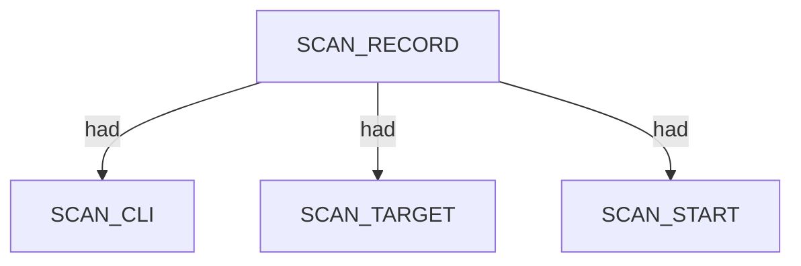
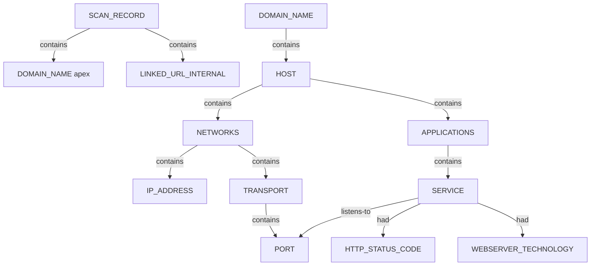

# httpx — proposed nugget graph structure

Ontology source: `.seed/05_Onotology_for_Nuggets.md` · `.seed/10_Rules_For_Httpx.md`.
Generator: `.seed/scripts/cli_corpus/adapters/httpx`
Artifacts: `httpx_<scenario_id>_proposed_nuggets_edges.json` and narrative `httpx_<scenario_id>_proposed_nuggets_edges_description.md` in `.docs/docs-for-cli-tools/nugget_structure`.

## Narrative reports (§4.3)

Graph JSON is converted to readable OSINT Markdown by `.seed/scripts/cli_corpus/core/narrative_engine.py` via `render_narrative()`. Reports follow scan → endpoint categories → appendix; `validate_narrative_coverage()` enforces full value inventory in tests.

## Scan head

SCAN_RECORD carries SCAN_CLI, SCAN_TARGET, SCAN_PROBE_PROFILE, host_input_count, timing, and exit descriptors. DOMAIN_NAME apex links from scan via contains.

## Live URL probe tree

Each JSONL live probe becomes LINKED_URL_INTERNAL under the scan. HOST or CDN endpoints own NETWORKS port chains and APPLICATIONS SERVICE nodes with HTTP and technology facts.

- Host lists are derived from upstream subfinder formal examinations.
- SERVICE listens-to PORT; HTTP_STATUS_CODE, HTTP_TITLE, WEBSERVER_TECHNOLOGY attach via had.
- CDN targets may emit CDN instead of HOST when edge signals are present.

## Subfinder upstream linkage

Each httpx scenario documents subfinder_scenario in bundle metadata with host_input_count versus live probe record counts.

## Scenario coverage

| Scenario key | Primary structures |
|---|---|
| from_subfinder_upside_au | DOMAIN_NAME + LINKED_URL_INTERNAL + SERVICE/HTTP facts |
| from_subfinder_squarepeg | Small VC web surface |
| from_subfinder_vcof_sparse | Ultra-sparse probe |
| from_subfinder_k2am_passive | Hosting-style SME probes |
| from_subfinder_k2am_active | Active-resolved host probes |
| from_subfinder_upside_com | TLD sibling probes |
| from_subfinder_sbs | Enterprise-scale probes |
| from_subfinder_invalid_clean_miss | Clean miss; empty records[] |

## Proposed nuggets

| Nugget | Type | Parent | Source | Relation |
|---|---|---|---|---|
| LINKED_URL_INTERNAL | ENTITY | SCAN_RECORD | url field | contains |
| HTTP_STATUS_CODE | DESCRIPTOR | SERVICE | status_code | had |
| WEBSERVER_TECHNOLOGY | DESCRIPTOR | SERVICE | tech[] | had |

Canonical vocabulary: `.docs/analysis/nuggets.json` and `.docs/analysis/nuggets_extension.json`. Combined cross-tool view: [../_Current_Ontology.md](../_Current_Ontology.md).

## Field mapping (structured → nugget)

| Structured path | Nugget | Notes |
|---|---|---|
| command | SCAN_CLI |  |
| target | SCAN_TARGET |  |
| probe_profile | SCAN_PROBE_PROFILE |  |
| host_input_count | SCAN_HOST_INPUT_COUNT |  |
| records[].url | LINKED_URL_INTERNAL | scan contains |
| records[].host | DOMAIN_NAME or HOST | domain contains host endpoint |
| records[].ip | IP_ADDRESS | NETWORKS contains via classify_ip |
| records[].status_code | HTTP_STATUS_CODE | had on SERVICE |
| records[].title | HTTP_TITLE |  |
| records[].webserver | WEBSERVER_BANNER |  |
| records[].tech[] | WEBSERVER_TECHNOLOGY |  |
| records[].cdn_name | PROVIDER_HOSTING |  |

## Review notes

- Structured capture uses -json JSONL converted to bundle JSON at harvest.
- Text pane is derived from structured records[]; no separate text-only scenario.
- Probe chains reuse Nmap-style NETWORKS → TRANSPORT → PORT topology per 10 H2.

Combined cross-tool view: [../_Current_Ontology.md](../_Current_Ontology.md).
