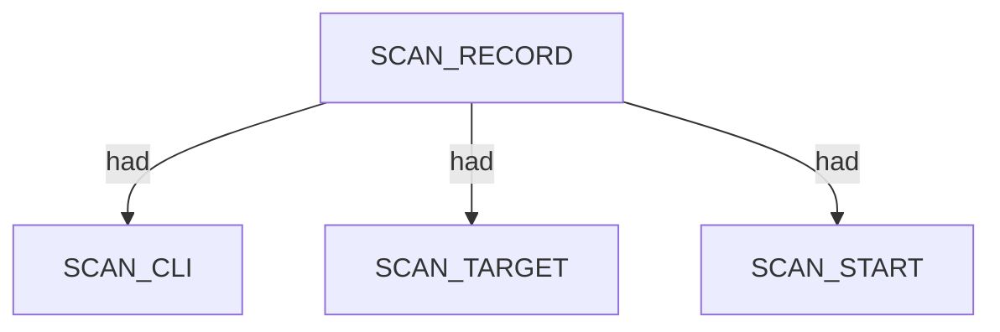
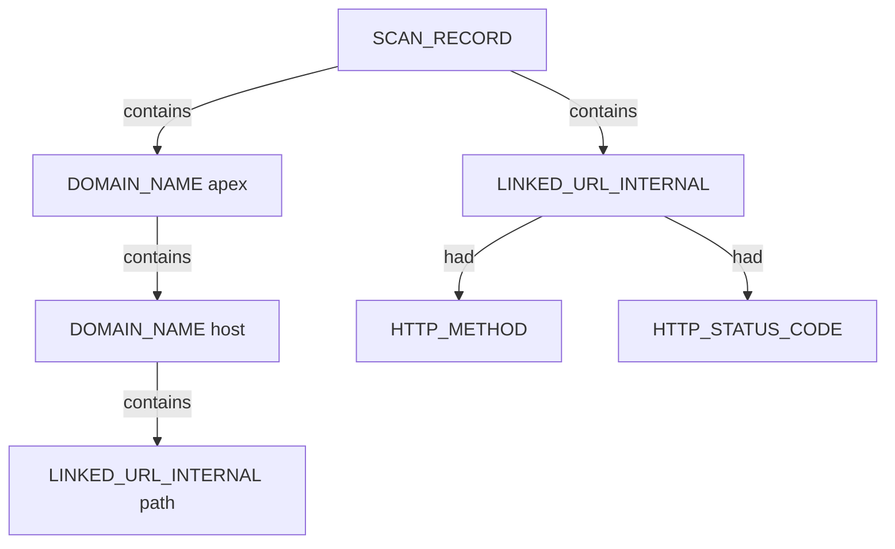

# Katana — proposed nugget graph structure

Ontology source: `.seed/05_Onotology_for_Nuggets.md` · `.seed/14_Business_Rules_for_Converting_Structured_Data_to_Graph.md`.
Generator: `.seed/scripts/cli_corpus/adapters/katana`
Artifacts: `katana_<scenario_id>_proposed_nuggets_edges.json` and narrative `katana_<scenario_id>_proposed_nuggets_edges_description.md` in `.docs/docs-for-cli-tools/nugget_structure`.

## Narrative reports (§4.3)

Graph JSON is converted to readable OSINT Markdown by `.seed/scripts/cli_corpus/core/narrative_engine.py` via `render_narrative()`. Reports follow scan → endpoint categories → appendix; `validate_narrative_coverage()` enforces full value inventory in tests.

## Scan head

SCAN_RECORD carries SCAN_CLI, SCAN_TARGET, SCAN_CRAWL_PROFILE, url_input_count, timing, and exit descriptors. DOMAIN_NAME apex links from scan via contains.

## Crawl URL tree

Each crawl JSONL row becomes LINKED_URL_INTERNAL under the scan. Host DOMAIN_NAME nodes nest discovered URLs; HTTP_METHOD and HTTP_STATUS_CODE attach via had.

- Seed URL lists are derived from upstream httpx formal examinations.
- UPSTREAM_SCENARIO_ID descriptor records the httpx scenario linkage on the scan head.
- Crawl scope uses fqdn filtering and bounded depth/duration per manifest crawl_profile.

## httpx upstream linkage

Katana scenarios document httpx_scenario in bundle metadata with url_input_count versus discovered URL record counts.

## Scenario coverage

| Scenario key | Primary structures |
|---|---|
| from_httpx_upside_au | DOMAIN_NAME apex + LINKED_URL_INTERNAL crawl tree |
| from_httpx_squarepeg | VC crawl surface |
| from_httpx_vcof_sparse | Ultra-sparse crawl |
| from_httpx_k2am_passive | SME passive-seed crawl |
| from_httpx_k2am_active | Active-seed crawl |
| from_httpx_upside_com | TLD sibling crawl |
| from_httpx_sbs | Enterprise bounded crawl |
| from_httpx_invalid_clean_miss | Deferred/clean miss; empty or placeholder records[] |

## Proposed nuggets

| Nugget | Type | Parent | Source | Relation |
|---|---|---|---|---|
| LINKED_URL_INTERNAL | ENTITY | SCAN_RECORD or DOMAIN_NAME | url field | contains |
| SCAN_CRAWL_PROFILE | DESCRIPTOR | SCAN_RECORD | manifest crawl_profile | had |

Canonical vocabulary: `.docs/analysis/nuggets.json` and `.docs/analysis/nuggets_extension.json`. Combined cross-tool view: [../_Current_Ontology.md](../_Current_Ontology.md).

## Field mapping (structured → nugget)

| Structured path | Nugget | Notes |
|---|---|---|
| command | SCAN_CLI |  |
| target | SCAN_TARGET |  |
| crawl_profile | SCAN_CRAWL_PROFILE |  |
| url_input_count | SCAN_URL_INPUT_COUNT |  |
| httpx_scenario | UPSTREAM_SCENARIO_ID |  |
| records[].url | LINKED_URL_INTERNAL | scan contains; host domain contains |
| records[].request.method | HTTP_METHOD | had on URL |
| records[].response.status_code | HTTP_STATUS_CODE | had on URL |

## Review notes

- Structured capture uses -j JSONL converted to bundle JSON at harvest.
- Crawl graphs do not invent HOST port/service trees unless response metadata justifies them.
- harvest_deferred scenarios ship placeholder bundles when httpx produced zero live URLs.

Combined cross-tool view: [../_Current_Ontology.md](../_Current_Ontology.md).
