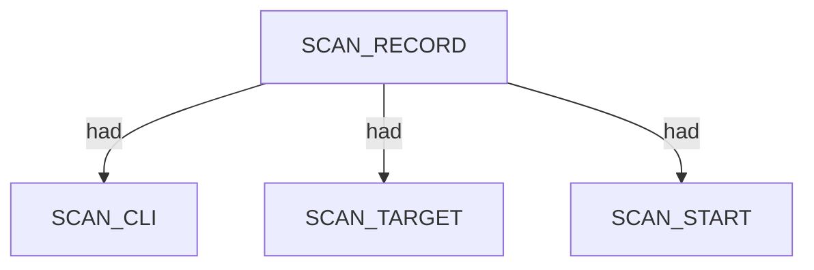
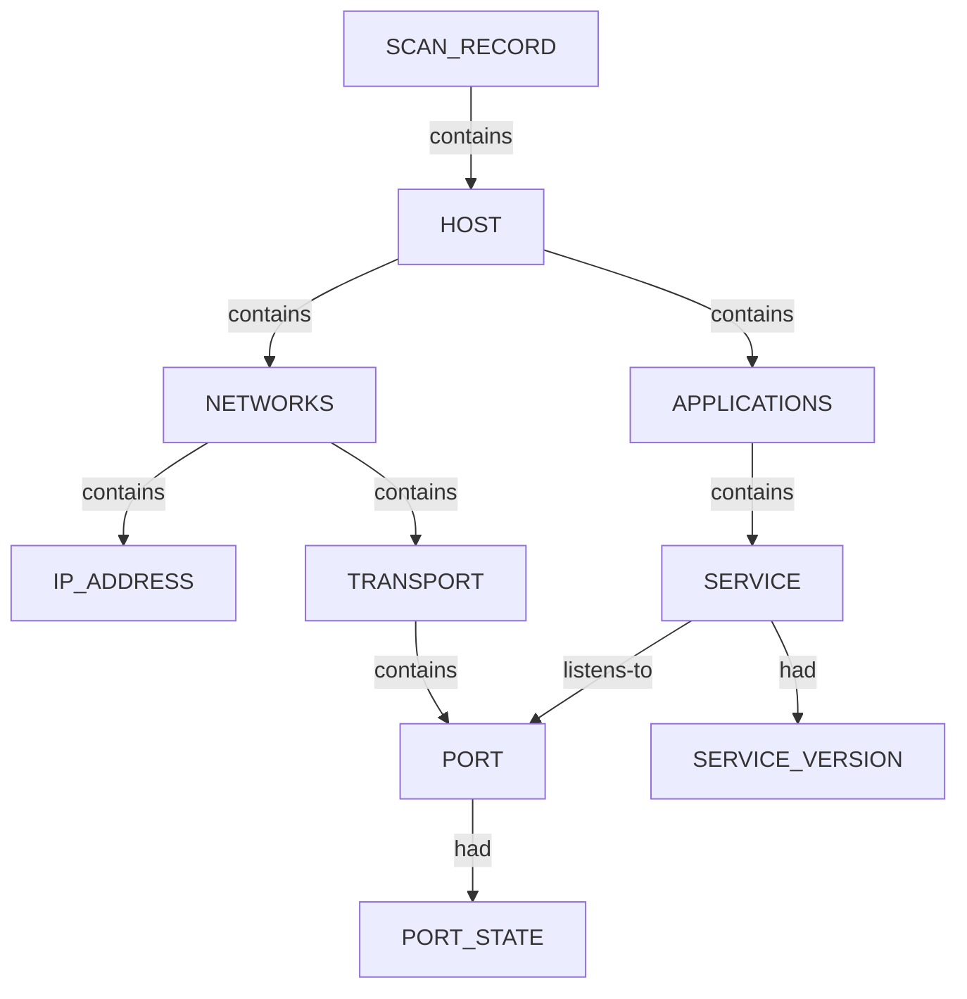

# Nerva — proposed nugget graph structure

Ontology source: `.seed/05_Onotology_for_Nuggets.md` · `.seed/07_Nerva_Scan_Record_Host_Correlation_Rulesets.md` · `.seed/07B_Nerva_Ontology_Rules.md`.
Generator: `.seed/scripts/cli_corpus/adapters/nerva`
Artifacts: `nerva_<scenario_id>_proposed_nuggets_edges.json` and narrative `nerva_<scenario_id>_proposed_nuggets_edges_description.md` in `.docs/docs-for-cli-tools/nugget_structure`.

## Narrative reports (§4.3)

Graph JSON is converted to readable OSINT Markdown by `.seed/scripts/cli_corpus/core/narrative_engine.py` via `render_narrative()`. Reports follow scan → endpoint categories → appendix; `validate_narrative_coverage()` enforces full value inventory in tests.

## Scan head

Every graph has one SCAN_RECORD with scan descriptors (SCAN_TARGET, SCAN_START, SCAN_ELAPSED, SCAN_EXIT_STATUS) via had from the JSON bundle metadata.

## Per-host service tree

Each JSON record maps to HOST (or CDN when edge markers justify reclassification), NETWORKS port chain, and APPLICATIONS SERVICE with version and technology descriptors.

- PORT_PROTOCOL carries tcp/udp transport.
- SERVICE listens-to PORT; SERVICE_VERSION carries banner/CPE when present.
- correlate_nerva_records may reclassify HOST to CDN for Cloudflare-style edges.

## CDN edge reclassification

When response headers and technology markers indicate a CDN edge, the endpoint may emit CDN instead of HOST while preserving NETWORKS and APPLICATIONS facts.

- CDN descriptors include PROVIDER_HOSTING and edge timing headers when present.

## Scenario coverage

| Scenario key | Primary structures |
|---|---|
| tcp_http_rich_json | HOST + PORT/SERVICE HTTP + technologies |
| tcp_ssh_misconfigs_json | HOST + SSH SERVICE + misconfig descriptors |
| tcp_https_praetorian_json | HOST or CDN + TLS HTTPS metadata |
| tcp_list_file_json | Multi-target HOST trees |
| tcp_fast_praetorian_json | Fast-mode fingerprint |
| tcp_closed_clean_miss | SCAN head only; empty records[] |

## Proposed nuggets

| Nugget | Type | Parent | Source | Relation |
|---|---|---|---|---|
| CDN | ENTITY | SCAN_RECORD | correlation markers | contains |
| PROVIDER_HOSTING | DESCRIPTOR | CDN or SERVICE | response headers | had |

Canonical vocabulary: `.docs/analysis/nuggets.json` and `.docs/analysis/nuggets_extension.json`. Combined cross-tool view: [../_Current_Ontology.md](../_Current_Ontology.md).

## Field mapping (structured → nugget)

| Structured path | Nugget | Notes |
|---|---|---|
| target | SCAN_TARGET |  |
| started_at | SCAN_START |  |
| duration_s | SCAN_ELAPSED |  |
| exit_code | SCAN_EXIT_STATUS |  |
| records[].host | HOST or CDN | correlation engine reclassifies CDN edges |
| records[].ip | IP_ADDRESS | under NETWORKS via classify_ip |
| records[].port | PORT |  |
| records[].proto | PORT_PROTOCOL |  |
| records[].service | SERVICE |  |
| records[].version | SERVICE_VERSION |  |
| records[].technologies[] | WEBSERVER_TECHNOLOGY | had on SERVICE |

## Review notes

- Requires open ports from upstream Nmap/Naabu discovery.
- Structured capture uses --json only; text pane is derived from records[].
- Misconfiguration findings attach as descriptors on SERVICE when plugins emit them.

Combined cross-tool view: [../_Current_Ontology.md](../_Current_Ontology.md).
