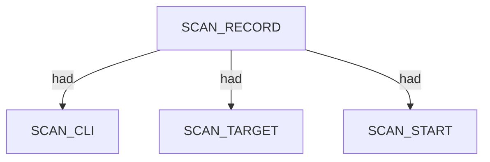
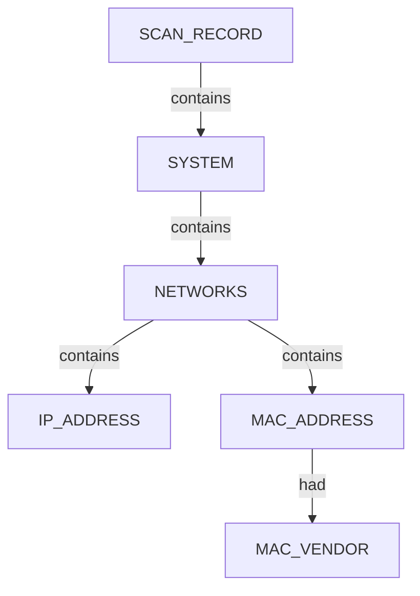

# Netdiscover — proposed nugget graph structure

Ontology source: `.seed/05_Onotology_for_Nuggets.md` · `.seed/06A_Updates_to_NetDiscover_Cli_App_Profiling copy.md`.
Generator: `.seed/scripts/cli_corpus/adapters/netdiscover`
Artifacts: `netdiscover_<scenario_id>_proposed_nuggets_edges.json` and narrative `netdiscover_<scenario_id>_proposed_nuggets_edges_description.md` in `.docs/docs-for-cli-tools/nugget_structure`.

## Narrative reports (§4.3)

Graph JSON is converted to readable OSINT Markdown by `.seed/scripts/cli_corpus/core/narrative_engine.py` via `render_narrative()`. Reports follow scan → endpoint categories → appendix; `validate_narrative_coverage()` enforces full value inventory in tests.

## Scan head

Every graph has one SCAN_RECORD entity with scan descriptors linked via had. Discovered systems link from the scan via contains.

- SCAN_ARGS, SCAN_TIMESTAMP, SCAN_TRIES, SCAN_EMPTY_SCANS, SCAN_DISCOVERED attach via had.

## System tree (all scenarios)

When only L2/L3 identity is known, emit SYSTEM (not HOST). Each system owns a NETWORKS category containing IPv4 and L2 facts; MAC_VENDOR attaches via had on MAC_ADDRESS.

- NETWORKS is a CATEGORY nugget under SYSTEM.
- MAC_VENDOR is a descriptor on MAC_ADDRESS via had; identical vendor strings dedupe.
- Instance ids use uuid5(ontology_seed, nugget_data) via graph_builder.nugget_instance_id().

## Multi-system scan overview

Rich LAN scenarios attach many SYSTEM nodes to one scan; each expands to its own NETWORKS tree keyed by IPv4.

- Netdiscover examinations do not emit TRACE, APPLICATIONS, ENVIRONMENT, or vulnerability categories.

## Scenario coverage

| Scenario key | Primary structures | Notes |
|---|---|---|
| local_subnet_active_parsable | SCAN + 12 SYSTEM; flat parseable output | 1 try / 0 empty |
| local_subnet_active_text | SCAN + SYSTEM; interactive TUI | multi-frame SCAN_TRIES / SCAN_EMPTY_SCANS |
| local_subnet_fast_parsable | SCAN + 1 SYSTEM; fast gateway probe |  |
| passive_snippet_text | SCAN + 11 SYSTEM; passive TUI | shared MAC_VENDOR for Unknown |
| sparse_subnet_parsable | SCAN + 12 SYSTEM; full /24 active rescan |  |

## Field mapping (structured → nugget)

| Structured path | Nugget | Notes |
|---|---|---|
| netdiscover_scan.args | SCAN_ARGS |  |
| netdiscover_scan.start_time | SCAN_TIMESTAMP |  |
| runstats.finished_time.end_time | SCAN_END_TIME |  |
| runstats.finished_time.summary | SCAN_SUMMARY |  |
| exit_status | SCAN_EXIT_STATUS |  |
| runstats.systems.scan_tries | SCAN_TRIES |  |
| runstats.systems.empty_scans | SCAN_EMPTY_SCANS |  |
| runstats.systems.discovered | SCAN_DISCOVERED |  |
| systems[].ipv4 | SYSTEM, IP_ADDRESS | scan contains SYSTEM; NETWORKS contains IP |
| systems[].mac | MAC_ADDRESS | NETWORKS contains MAC |
| systems[].mac_vendor | MAC_VENDOR | MAC_ADDRESS had MAC_VENDOR |

## Review notes

- Relations use ontology vocabulary contains and had only.
- Emit SYSTEM (not HOST) when only MAC vendor and IPv4 are known.
- Runtime may use Windows LAN simulator when WSL mirrored eth1 is unavailable.

Combined cross-tool view: [../_Current_Ontology.md](../_Current_Ontology.md).
