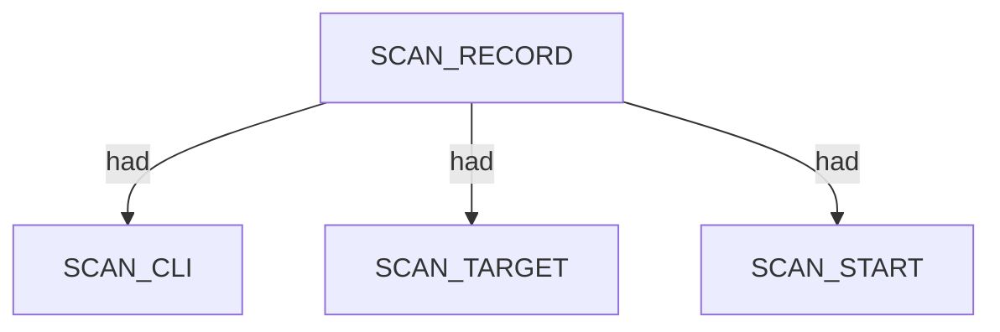
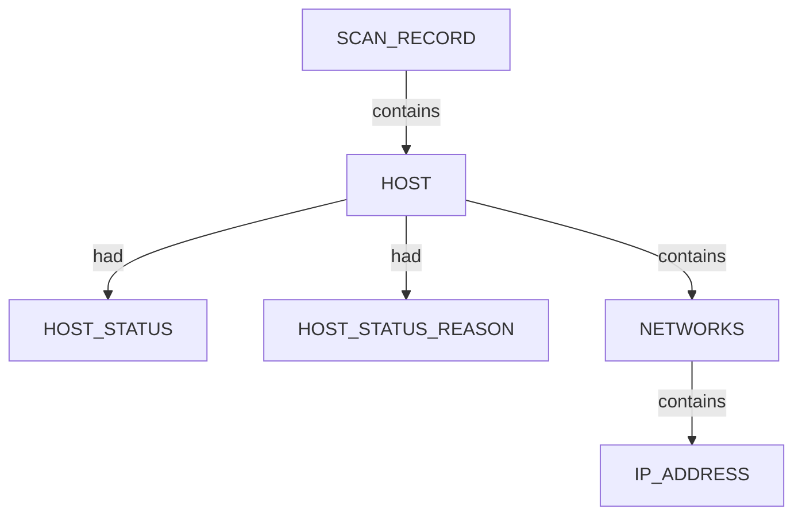
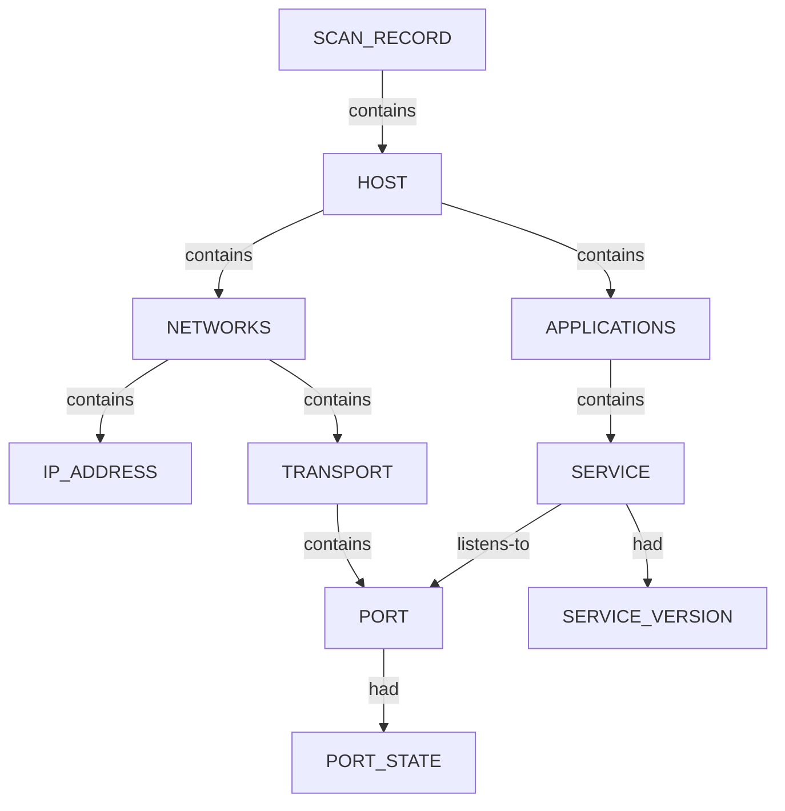
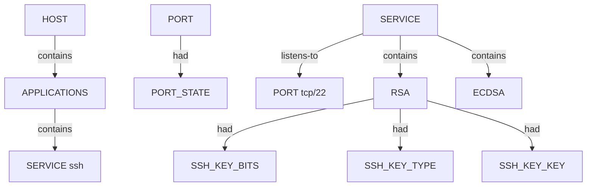
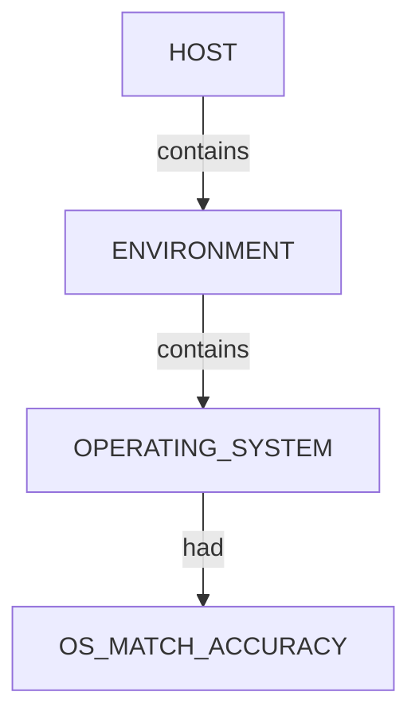
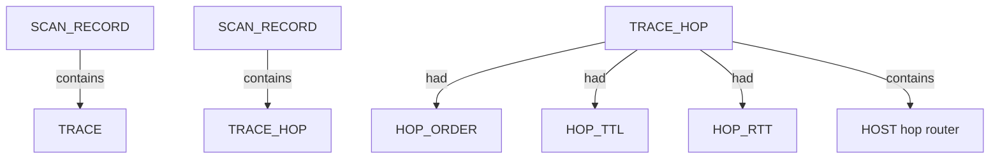

# Nmap — proposed nugget graph structure

Ontology source: `.seed/05_Onotology_for_Nuggets.md` · `.seed/06B_NMAP_Ontology_Update_Ruleset.md` · `.seed/06_Updates_to_NMAP_Cli_App_Profiling.md`.
Generator: `.seed/scripts/cli_corpus/adapters/nmap`
Artifacts: `nmap_<scenario_id>_proposed_nuggets_edges.json` and narrative `nmap_<scenario_id>_proposed_nuggets_edges_description.md` in `.docs/docs-for-cli-tools/nugget_structure`.

## Narrative reports (§4.3)

Graph JSON is converted to readable OSINT Markdown by `.seed/scripts/cli_corpus/core/narrative_engine.py` via `render_narrative()`. Reports follow scan → endpoint categories → appendix; `validate_narrative_coverage()` enforces full value inventory in tests.

## Scan head

Every graph has one SCAN_RECORD entity with scan descriptors (SCAN_CLI, SCAN_TARGET, SCAN_VERSION, SCAN_START, SCAN_SUMMARY, …) linked via had. Discovered hosts link from scan via contains.

## Host tree (all scenarios)

HOST_STATUS and HOST_STATUS_REASON attach to HOST via had when reachability is reported.

- HOST canonical key is the primary IPv4 address (or first address).
- INTERNET_NAME descriptors attach to HOST when Nmap reports hostnames.

## Port and service tree (port scans)

Qualified HOST scans extend NETWORKS with TRANSPORT and PORT; APPLICATIONS contains SERVICE entities that listens-to their PORT. Port protocol and state are descriptors.

- PORT_STATE values include open, filtered, closed, open|filtered (UDP).
- listens-to links each SERVICE to its PORT whenever Nmap reports a service name.
- SERVICE_VERSION carries product + version; SERVICE_FINGERPRINT carries servicefp when present.

## SSH service and host keys (APPLICATIONS branch)

When Nmap runs the ssh-hostkey NSE script against an open SSH port, the graph extends the APPLICATIONS branch with key SUBENTITY nodes per algorithm family.

- Key nugget_id is the algorithm family (RSA, ECDSA, EDDSA, DSA).
- Multiple keys on one service are sibling SUBENTITY nodes under the same SERVICE.

## OS fingerprint (-A / OS detection)

Best osmatch by accuracy is selected when multiple matches exist.

## Traceroute trace (host-to-host path)

Nmap records hop IPs in XML; the graph models hosts along the path. The final hop reuses the target HOST node when IPs match.

## Scenario coverage

| Scenario key | Primary structures |
|---|---|
| host_discovery_permissive_xml | SCAN + HOST + HOST_STATUS |
| host_discovery_corporate_xml | SCAN + HOST + HOST_STATUS |
| host_discovery_local_subnet_xml | SCAN + multiple HOST |
| tcp_top_ports_permissive_xml | HOST + PORT/SERVICE (open TCP) |
| tcp_top_ports_corporate_xml | HOST + PORT/SERVICE for all table rows |
| tcp_top_ports_local_xml | Multiple hosts, sparse ports |
| service_version_permissive_xml | SERVICE + SERVICE_VERSION + SERVICE_EXTRAINFO + CPE |
| os_aggressive_permissive_xml | ENVIRONMENT + OS + TRACE |
| nse_default_permissive_xml | SERVICE + script-heavy ports; SSH keys when ssh-hostkey fires |
| udp_top_permissive_xml | UDP PORT_STATE variants |
| traceroute_permissive_xml | TRACE host chain |
| skip_ping_permissive_xml | HOST without prior ping semantics |
| capstone_permissive_xml | Combined rich scan; often includes SSH keys on port 22 |
| service_version_corporate_xml | SERVICE + SERVICE_VERSION + SERVICE_FINGERPRINT |
| windows_enrich_local_xml | Local Windows enrichment |

## Proposed nuggets

| Nugget | Type | Parent | Source | Relation |
|---|---|---|---|---|
| SERVICE | ENTITY | APPLICATIONS | service@name | contains; listens-to → PORT |
| SERVICE_VERSION | DESCRIPTOR | SERVICE | service@product + @version | had |
| SERVICE_FINGERPRINT | DESCRIPTOR | SERVICE | service@servicefp | had |
| SERVICE_EXTRAINFO | DESCRIPTOR | SERVICE | service@extrainfo | had |
| CPE_URL | SUBENTITY | SERVICE | service/cpe | contains |
| HTTP_TITLE | DESCRIPTOR | SERVICE | NSE http-title | had |

Canonical vocabulary: `.docs/analysis/nuggets.json` and `.docs/analysis/nuggets_extension.json`. Combined cross-tool view: [../_Current_Ontology.md](../_Current_Ontology.md).

## Field mapping (structured → nugget)

| Structured path | Nugget | Notes |
|---|---|---|
| nmaprun@args | SCAN_CLI |  |
| host/status@state | HOST_STATUS |  |
| host/status@reason | HOST_STATUS_REASON |  |
| address@addr | IP_ADDRESS | under NETWORKS via classify_ip |
| hostname@name | INTERNET_NAME | had on HOST |
| port/state@state | PORT_STATE |  |
| service@product + @version | SERVICE_VERSION |  |
| service@servicefp | SERVICE_FINGERPRINT |  |
| service@extrainfo | SERVICE_EXTRAINFO |  |
| service/cpe | CPE_URL |  |
| script@id=ssh-hostkey | RSA|ECDSA|EDDSA|DSA | SSH key SUBENTITY under SERVICE |
| os/osmatch@name | OPERATING_SYSTEM |  |
| trace@proto | TRACE_PROTOCOL |  |
| trace/hop@ttl | HOP_TTL |  |
| trace/hop@rtt | HOP_RTT |  |
| trace/hop@ipaddr | IP_ADDRESS | under hop HOST |

## Review notes

- Relations use ontology vocabulary contains, had, listens-to (not has, listens on, discovered).
- NSE script output is not fully decomposed in v1 proposals; port/service nodes carry primary facts.
- extraports aggregate filtered counts are not expanded to individual port nodes.

Combined cross-tool view: [../_Current_Ontology.md](../_Current_Ontology.md).
