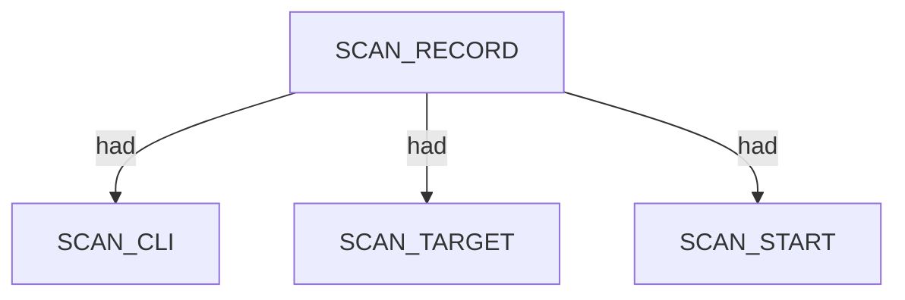
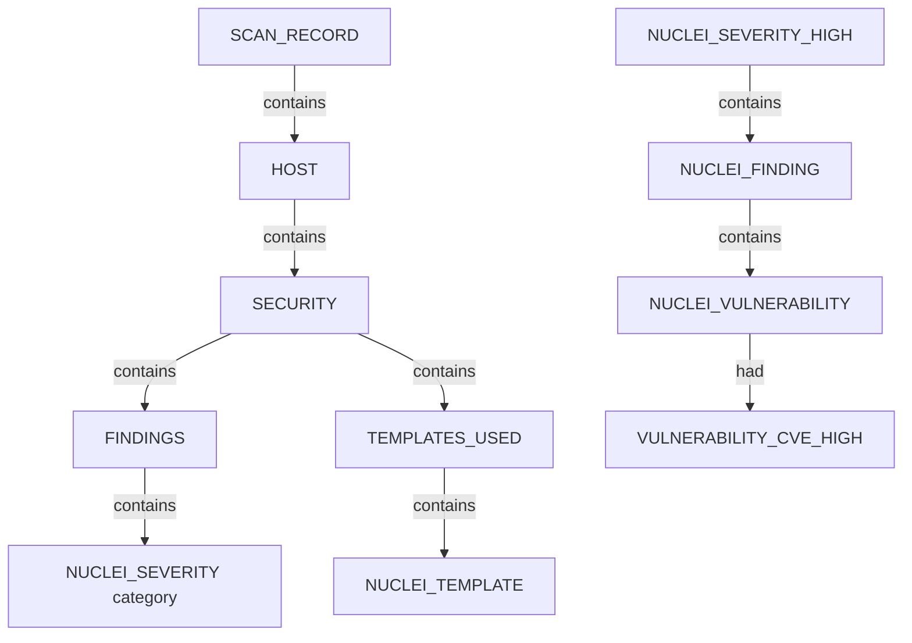

# Nuclei — proposed nugget graph structure

Ontology source: `.seed/05_Onotology_for_Nuggets.md` · `.seed/11_Ontology_for_Nuclei.md` · `.seed/11B_Rules_for_Nuclei.md`.
Generator: `.seed/scripts/cli_corpus/adapters/nuclei`
Artifacts: `nuclei_<scenario_id>_proposed_nuggets_edges.json` and narrative `nuclei_<scenario_id>_proposed_nuggets_edges_description.md` in `.docs/docs-for-cli-tools/nugget_structure`.

## Narrative reports (§4.3)

Graph JSON is converted to readable OSINT Markdown by `.seed/scripts/cli_corpus/core/narrative_engine.py` via `render_narrative()`. Reports follow scan → endpoint categories → appendix; `validate_narrative_coverage()` enforces full value inventory in tests.

## Scan head

SCAN_RECORD carries SCAN_CLI, SCAN_TARGET, SCAN_FINDING_COUNT, timing, and exit descriptors. Target HOST may link from scan when a single URL/host seed is used.

## Vulnerability findings tree

Each JSONL finding creates or reuses HOST, SECURITY category, TEMPLATES_USED, FINDINGS severity buckets, NUCLEI_FINDING rows, and NUCLEI_VULNERABILITY observations.

- Severity categories map to NUCLEI_SEVERITY_* CATEGORY nodes.
- CVE tiers attach as VULNERABILITY_CVE_* descriptors on the vulnerability node.
- SERVICE may link to findings via had when port context is present.

## Template inventory branch

NUCLEI_TEMPLATE entities deduplicate under TEMPLATES_USED with template metadata descriptors (name, tags, author, protocol).

## Tech fingerprint pass

Tag-targeted tech fingerprint scenarios may emit info-severity findings that surface as WEBSERVER_TECHNOLOGY-style descriptors on vulnerabilities when templates report tech.

## Scenario coverage

| Scenario key | Primary structures |
|---|---|
| scanme_all_templates | HOST + SECURITY + mixed severity FINDINGS |
| pg_shadowlogic_weblogic_cves | CVE-tier VULNERABILITY_CVE_* descriptors |
| cipherheart_redis_lab | Network exposure + CVE findings |
| pg_graphql_graphql_misconfig | GraphQL misconfiguration findings |
| pg_dvwa_tech_fingerprint | Info-severity tech fingerprint findings |

## Proposed nuggets

| Nugget | Type | Parent | Source | Relation |
|---|---|---|---|---|
| SECURITY | CATEGORY | HOST | 11B SEC1 | contains |
| FINDINGS | CATEGORY | SECURITY | 11B FIND1 | contains |
| NUCLEI_FINDING | ENTITY | NUCLEI_SEVERITY_* | template-id + matched-at + timestamp | contains |
| NUCLEI_VULNERABILITY | ENTITY | NUCLEI_FINDING | finding identity | contains |
| NUCLEI_TEMPLATE | ENTITY | TEMPLATES_USED | template-id | contains |

Canonical vocabulary: `.docs/analysis/nuggets.json` and `.docs/analysis/nuggets_extension.json`. Combined cross-tool view: [../_Current_Ontology.md](../_Current_Ontology.md).

## Field mapping (structured → nugget)

| Structured path | Nugget | Notes |
|---|---|---|
| command | SCAN_CLI |  |
| target | SCAN_TARGET |  |
| finding_summary_lines | SCAN_FINDING_COUNT |  |
| records[].host | HOST | scan contains |
| records[].template-id | NUCLEI_TEMPLATE | TEMPLATES_USED contains |
| records[].info.severity | NUCLEI_SEVERITY_* | FINDINGS severity category |
| records[].info.name | VULNERABILITY_GENERAL | had on NUCLEI_VULNERABILITY |
| records[].info.classification.cve-id | VULNERABILITY_CVE_* | tier by severity |
| records[].matched-at | NUCLEI_MATCHED_AT | had on NUCLEI_FINDING |
| records[].port | SERVICE | host contains; had to vulnerability |

## Review notes

- One batch goal per examination scenario; avoid full-template sweeps on hardened targets.
- Structured capture uses -jsonl converted to bundle JSON at harvest.
- Interactsh/OOB templates may be blocked upstream; document as proven limitation not silent gap.

Combined cross-tool view: [../_Current_Ontology.md](../_Current_Ontology.md).
