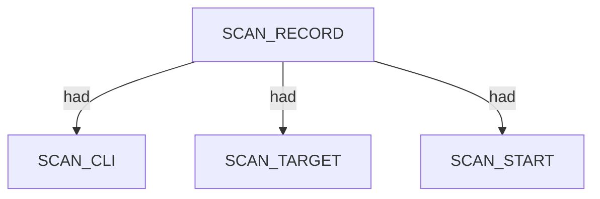
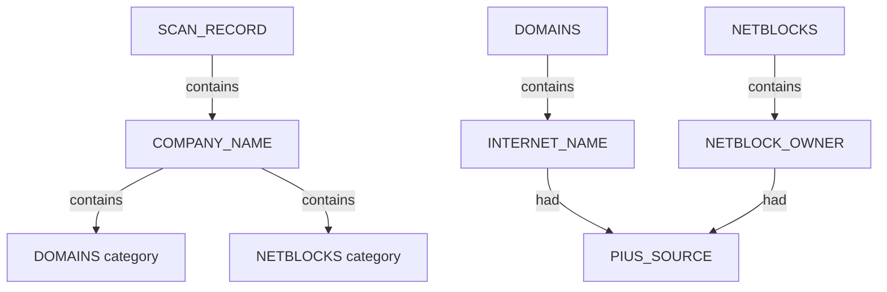

# Pius — proposed nugget graph structure

Ontology source: `.seed/05_Onotology_for_Nuggets.md` · `.seed/08_Rules_for_Pius.md`.
Generator: `.seed/scripts/cli_corpus/adapters/pius`
Artifacts: `pius_<scenario_id>_proposed_nuggets_edges.json` and narrative `pius_<scenario_id>_proposed_nuggets_edges_description.md` in `.docs/docs-for-cli-tools/nugget_structure`.

## Narrative reports (§4.3)

Graph JSON is converted to readable OSINT Markdown by `.seed/scripts/cli_corpus/core/narrative_engine.py` via `render_narrative()`. Reports follow scan → endpoint categories → appendix; `validate_narrative_coverage()` enforces full value inventory in tests.

## Scan head

SCAN_RECORD carries SCAN_CLI, SCAN_TARGET, SCAN_TARGET_ORG, timing, and exit descriptors via had. When org is known, COMPANY_NAME links from scan via contains.

## Organisation findings tree

NDJSON records classify into DOMAINS and NETBLOCKS categories under COMPANY_NAME. INTERNET_NAME and NETBLOCK_OWNER entities carry PIUS_SOURCE and confidence descriptors.

- Type:domain rows become INTERNET_NAME under DOMAINS.
- Type:cidr rows become NETBLOCK_OWNER under NETBLOCKS.
- Type:preseed rows are skipped in graph output.

## Wikidata and gleif enrichment

Corporate plugin stacks may attach subsidiary COMPANY_NAME nodes and gleif/wikidata descriptors on domain and netblock entities when plugins return structured enrichment.

- needs_review confidence surfaces as descriptor facts, not new relation types.

## Scenario coverage

| Scenario key | Primary structures | Notes |
|---|---|---|
| crt_praetorian_ndjson | COMPANY_NAME + DOMAINS + rich INTERNET_NAME |  |
| crt_linode_ndjson | High-volume crt-sh domains | fixture fallback when live crt-sh empty |
| corporate_bbc_gleif_ndjson | gleif/wikidata/whois/crt corporate stack |  |
| corporate_squarepeg_ndjson | gleif corporate domains |  |
| corporate_upside_ndjson | gleif corporate domains |  |
| corporate_k2am_ndjson | deferred harvest when target offline |  |

## Proposed nuggets

| Nugget | Type | Parent | Source | Relation |
|---|---|---|---|---|
| COMPANY_NAME | ENTITY | SCAN_RECORD | org argument | contains |
| DOMAINS | CATEGORY | COMPANY_NAME | 08 R3 | contains |
| NETBLOCKS | CATEGORY | COMPANY_NAME | 08 R3 | contains |
| PIUS_SOURCE | DESCRIPTOR | INTERNET_NAME or NETBLOCK_OWNER | record source plugin | had |

Canonical vocabulary: `.docs/analysis/nuggets.json` and `.docs/analysis/nuggets_extension.json`. Combined cross-tool view: [../_Current_Ontology.md](../_Current_Ontology.md).

## Field mapping (structured → nugget)

| Structured path | Nugget | Notes |
|---|---|---|
| command | SCAN_CLI |  |
| target | SCAN_TARGET |  |
| org | SCAN_TARGET_ORG |  |
| started_at | SCAN_START |  |
| duration_s | SCAN_ELAPSED |  |
| exit_code | SCAN_EXIT_STATUS |  |
| records[].Type=domain | INTERNET_NAME | DOMAINS contains; PIUS_SOURCE had |
| records[].Type=cidr | NETBLOCK_OWNER | NETBLOCKS contains; PIUS_SOURCE had |
| records[].source | PIUS_SOURCE |  |
| records[].confidence | CONFIDENCE_SCORE | had when needs_review |

## Review notes

- NDJSON must be captured via subprocess stdout; shell redirect yields empty files.
- stderr progress banners are stored in structured.stderr_banner only.
- WSL networking may require retry when stdout is empty after wsl --shutdown hygiene.

Combined cross-tool view: [../_Current_Ontology.md](../_Current_Ontology.md).
