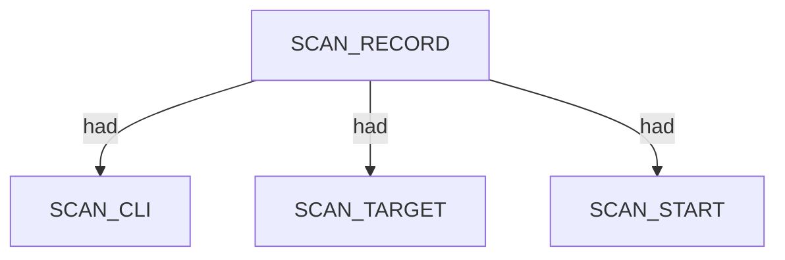
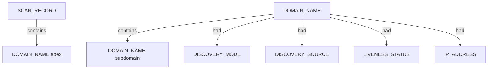

# Subfinder — proposed nugget graph structure

Ontology source: `.seed/05_Onotology_for_Nuggets.md` · `.seed/09_Ontology_For_Subfinder.md`.
Generator: `.seed/scripts/cli_corpus/adapters/subfinder`
Artifacts: `subfinder_<scenario_id>_proposed_nuggets_edges.json` and narrative `subfinder_<scenario_id>_proposed_nuggets_edges_description.md` in `.docs/docs-for-cli-tools/nugget_structure`.

## Narrative reports (§4.3)

Graph JSON is converted to readable OSINT Markdown by `.seed/scripts/cli_corpus/core/narrative_engine.py` via `render_narrative()`. Reports follow scan → endpoint categories → appendix; `validate_narrative_coverage()` enforces full value inventory in tests.

## Scan head

SCAN_RECORD carries SCAN_CLI, SCAN_TARGET, SCAN_MODE, timing, and exit descriptors. The seed apex DOMAIN_NAME always links from scan via contains.

## Subdomain enumeration tree

Each JSONL host becomes a DOMAIN_NAME under the scan. Passive mode leaves liveness unconfirmed; active mode with IP attaches IP_ADDRESS via had on the domain node.

- DISCOVERY_SOURCE and DISCOVERY_MODE descriptors capture passive/active provenance.
- DOMAIN_NAME_PARENT derives registrable parent labels per 09 S6.
- CDN_REVIEW_NEEDED may attach when multiple hosts share one IP.

## Active resolution with IP

Active enumeration (-active -oI) attaches resolved IP_ADDRESS via had and sets LIVENESS_STATUS to confirmed on the domain node.

## Scenario coverage

| Scenario key | Primary structures |
|---|---|
| corporate_upside_au_passive_cs | DOMAIN_NAME apex + passive subdomains + sources |
| corporate_squarepeg_passive_cs | Small VC subdomain set |
| corporate_vcof_sparse_passive | Ultra-sparse single host |
| corporate_k2am_passive_cs | Hosting-style SME enumeration |
| corporate_k2am_active_oI | Active mode + IP_ADDRESS had edges |
| corporate_upside_com_passive_cs | TLD sibling enumeration |
| enterprise_sbs_passive_cs | Enterprise-scale volume |
| invalid_domain_clean_miss | SCAN + apex only; empty records[] |

## Proposed nuggets

| Nugget | Type | Parent | Source | Relation |
|---|---|---|---|---|
| DOMAIN_NAME | ENTITY | SCAN_RECORD | host field | contains |
| DISCOVERY_SOURCE | DESCRIPTOR | DOMAIN_NAME | sources[] | had |
| LIVENESS_STATUS | DESCRIPTOR | DOMAIN_NAME | passive vs active | had |

Canonical vocabulary: `.docs/analysis/nuggets.json` and `.docs/analysis/nuggets_extension.json`. Combined cross-tool view: [../_Current_Ontology.md](../_Current_Ontology.md).

## Field mapping (structured → nugget)

| Structured path | Nugget | Notes |
|---|---|---|
| command | SCAN_CLI |  |
| target | SCAN_TARGET |  |
| enumeration_mode | SCAN_MODE |  |
| started_at | SCAN_START |  |
| duration_s | SCAN_ELAPSED |  |
| exit_code | SCAN_EXIT_STATUS |  |
| records[].host | DOMAIN_NAME | scan contains; parent DOMAIN_NAME_PARENT had |
| records[].sources[] | DISCOVERY_SOURCE | had on domain |
| records[].ip | IP_ADDRESS | had on domain when active |
| records[].mode | DISCOVERY_MODE | had on domain |

## Review notes

- Duplicate apex host equal to seed is deduplicated by GraphBuilder.
- Per-source separate nodes are collapsed to DISCOVERY_SOURCE descriptors.
- DNS resolves-to relation is deferred until SPEC-approved; IP uses had on domain.

Combined cross-tool view: [../_Current_Ontology.md](../_Current_Ontology.md).
